# NetWorth — The Complete User Guide

*Everything your family owns, in one Excel file — refreshed with a
double-click. This guide walks through every feature with real, worked
examples. Every screenshot below comes from the sample workbook that ships
with the app, so what you see here is exactly what you'll see on screen.*

**You don't need to read all of this.** The workbook teaches itself — every
tab has a hint line, every unusual column has a hover note, and the gold
Guide tab inside the file is a 2-minute version of this document. Come here
when you want the full story of one feature.

---

## Contents

1. [The one rule, and the colours](#1-the-one-rule-and-the-colours)
2. [Getting started](#2-getting-started)
3. [The Dashboard — your answers](#3-the-dashboard--your-answers)
4. [One tab per person](#4-one-tab-per-person)
5. [Equity — your shares](#5-equity--your-shares)
6. [Mutual funds — a summary tab and a ledger tab](#6-mutual-funds--a-summary-tab-and-a-ledger-tab)
7. [Fixed deposits, PPF and EPF](#7-fixed-deposits-ppf-and-epf)
8. [Bonds](#8-bonds)
9. [Gold & silver](#9-gold--silver)
10. [NPS](#10-nps)
11. [House, cash, insurance — Manual Assets](#11-house-cash-insurance--manual-assets)
12. [Dividends — income you can see](#12-dividends--income-you-can-see)
13. [Selling & the taxman's view](#13-selling--the-taxmans-view)
14. [Your return figure (XIRR), honestly](#14-your-return-figure-xirr-honestly)
15. [The Settings tab — show only what you own](#15-the-settings-tab--show-only-what-you-own)
16. [The updater — what a run actually does](#16-the-updater--what-a-run-actually-does)
17. [Privacy — the mask and the lock](#17-privacy--the-mask-and-the-lock)
18. [When something looks wrong](#18-when-something-looks-wrong)
19. [Words you'll see](#19-words-youll-see)

---

## 1. The one rule, and the colours

**Type only into the coloured cells.** That's the whole rule.

- **Blue / yellow cells** are inputs — names, quantities, dates, prices you
  paid. They are yours; the updater never overwrites them.
- **Grey cells** work themselves out — totals, today's values, returns.
  Leave them alone; they refresh on every update.
- **Green** means gain, **red** means loss, **amber** means *take a look* —
  an estimate, a stale price, or something worth checking.

You can add rows, delete rows and sort rows freely on any input tab. The
only things to leave alone are the tab names and the column layout.

The tab strip is colour-coded too: **navy** for your totals, **teal** for
each family member, **blue** where you type, **grey** for the automatic
tabs, **gold** for the Guide.

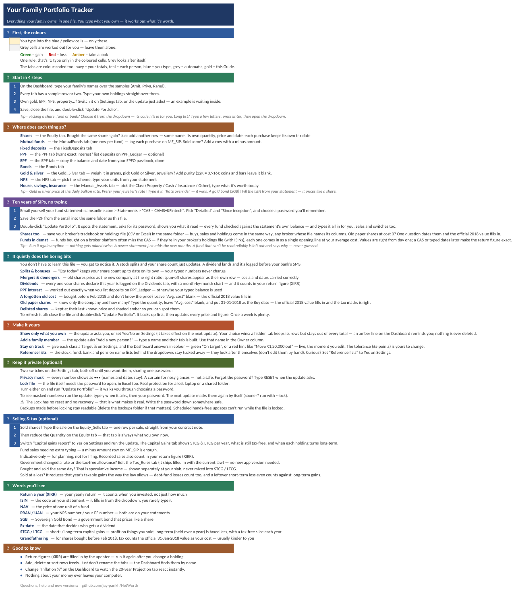

---

## 2. Getting started

1. **Download** the zip for your computer from the
   [Releases page](https://github.com/jay-parikh/NetWorth/releases) and
   unzip it anywhere. Keep the files together.
2. **Open** `Family_Portfolio_Tracker.xlsx`. It opens calm on purpose: five
   everyday tabs (shares, mutual funds, fixed deposits, PPF, bonds) with a
   fictional sample family — Amit, Priya and Rahul — showing how each tab
   works. Gold, EPF, NPS, property and more are one switch away on the
   Settings tab, each with a worked example already inside.
3. **Make it yours.** Type your family's names over the sample names in the
   yellow cells on the Dashboard, then overtype the sample rows with your
   own holdings. Stocks and funds are picked from dropdowns — type the
   first few letters, press Enter, then open the list — and the ISIN (the
   code on your statement) fills in by itself.
4. **Save, close the file, and double-click `Update Portfolio`**
   (Windows: `Update Portfolio.exe`; macOS: right-click
   `Update Portfolio.command` → Open, first time only). It backs your file
   up, fetches today's prices and NAVs, recomputes every figure and prints
   a one-screen summary.

> **First run only:** Windows may show a SmartScreen warning (**More info →
> Run anyway**); macOS a Gatekeeper prompt. The apps aren't code-signed
> yet. Nothing is installed and nothing about your money leaves your
> computer — the only internet use is *downloading* public prices.

**The workbook must be closed while the updater runs.** If it's open,
the updater says so and stops — nothing is touched.

---

## 3. The Dashboard — your answers

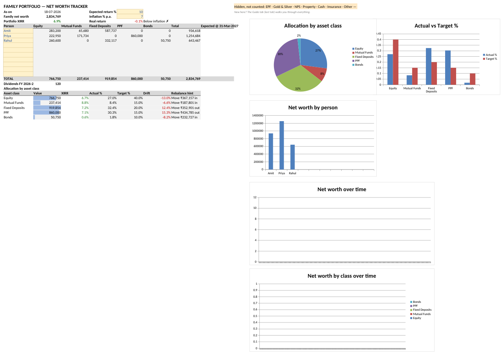

The Dashboard answers the questions that matter, top-left first:

- **Family net worth** — the sample family is worth **₹28,34,769** as on
  18-07-2026. Every enabled asset class, every person, one number.
- **Portfolio XIRR** — XIRR is your return a year, worked out from every
  rupee in and out on its actual date. The sample family's is **6.9%**.
  Next to it: your **real return** after the inflation you set (the sample
  uses 7%, so 6.9% shows *Below inflation ✗* — honest, not flattering).
- **The person × asset grid** — who owns what, per class. Priya leads the
  sample family with ₹12,54,684.
- **Dividends FY 2026-27** — cash your shares declared this financial
  year (₹120 so far in the sample; the Dividends tab has the detail).
- **Allocation by asset class** — value, XIRR, actual % vs your target %.
  Set a target and the Dashboard answers in colour: the sample sets Equity
  at 40% but holds 27%, so the hint says **Move ₹3,67,157 in** in red.
  Green rows read *On target*. The tolerance (±5 points) is yours to
  change on Settings.
- **Five charts** — allocation pie, actual-vs-target, per-person, and two
  trend charts that fill in as updates build your history (a fresh file
  shows them empty — after a few updates you'll see your net worth as a
  line, and stacked by class).

The **Projection** tab next door takes your expected return and inflation
and draws your corpus over the next 20 years — change *Inflation %* on the
Dashboard and watch it react instantly.

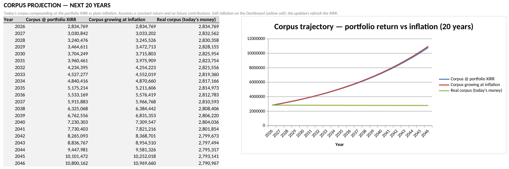

---

## 4. One tab per person

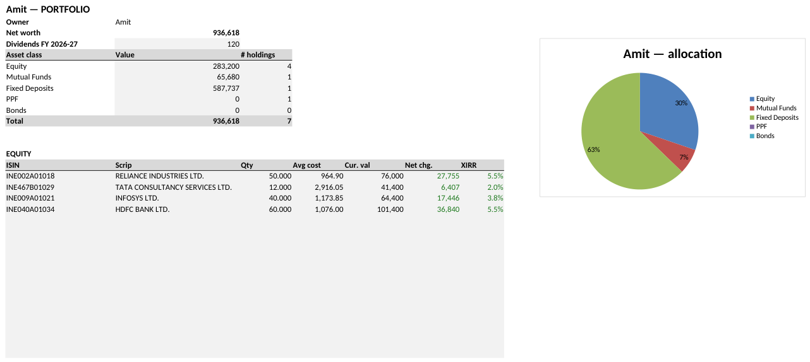

Each family member gets a teal tab: their net worth (Amit: **₹9,36,618**),
their dividends this financial year, a per-class breakdown with holding
counts, an allocation pie, and compact lists of everything they own. It's
all live formulas over the input tabs — nothing to maintain.

**Adding a person:** the updater asks *"Add a new person?"* — type the
name, and their tab, Dashboard row and By-Scrip column are built on the
next regeneration. Use exactly that name in the Owner column of the input
tabs. (Up to 10 people.)

---

## 5. Equity — your shares

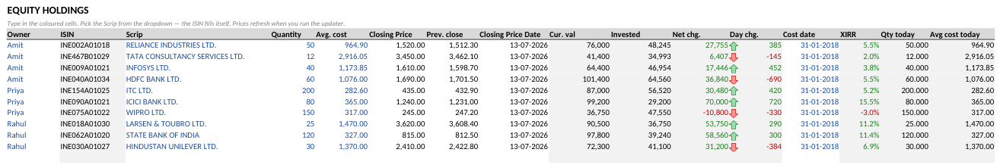

One row per holding: Owner, Scrip (from the dropdown), **Quantity** and
**Avg cost** — the price you paid per share. Everything else is automatic.

**Bought the same share more than once?** Just add another row — pick the
same name from the dropdown, and give each purchase its own Quantity,
price and Buy date. Everything sums correctly across the rows, and the
tax view then shows **each purchase's own "turns long-term" date** — so
you can see which lot is already taxed at the kinder rate before you
sell. (Prefer less typing? One combined row with the average cost and the
first buy date also works — the name *Avg. cost* is for exactly that —
but the tax dates blur together.) There is room for 1,500 rows — and if you
ever exceed a sheet's limit, the updater refuses to run rather than lose
a row: it stops before touching anything and tells you which sheet and
what to move.

**Worked example — Amit's Reliance row:** 50 shares bought at ₹964.90.
The updater fetched the closing price ₹1,520 (13-07-2026, from the BSE and
NSE files merged), so *Cur. val* shows **₹76,000**, *Net chg.* **+₹27,755**
in green, the day's move **+₹385** with a ▲ arrow, and the row's own XIRR
**5.5%**. Priya's Wipro row shows the other face: **−₹10,800** in red and
an XIRR of −3.0%. The file never pretends.

Things this tab quietly does for you:

- **Splits & bonuses** — *Qty today* keeps your share count current
  without ever changing what you typed. Buy 10, get a 1:1 bonus, and
  *Qty today* reads 20 while your Quantity cell still says 10.
- **Mergers & demergers** — old shares price as the new company at the
  right ratio, with your cost and purchase date carried in full (that's
  the tax rule). A demerger *appends* the spun-off company as its own row
  with the company-notified cost split. The Corporate_Actions tab (visible
  when you switch on *Reference lists*) is the audit trail.
- **Forgotten old costs** — bought before February 2018 and don't know
  the price? Leave *Avg. cost* blank: the official 31-01-2018 value (the
  tax "grandfathering" value) fills in, marked amber.
- **Old paper shares, now in demat** — certificates from decades ago,
  where you know only the company and the quantity? Type the quantity,
  leave *Avg. cost* blank, and put **31-01-2018** as the Buy date. That
  date is inside the grandfathering window, so the official 2018 value
  becomes your cost, the holding counts as long-term (it is, by now), and
  the tax view is right. Nothing else to hunt for.
- **Delisted shares** — kept at their last traded price and flagged, never
  silently stale. You can type a price override.

---

## 6. Mutual funds — a summary tab and a ledger tab

Funds are two tabs because the truth lives in the purchases:

**MF_SIP is the ledger** — one row per purchase, SIP instalment or
redemption. Pick the scheme from the dropdown, type the date, the amount
and the NAV on that date (NAV = the price of one unit of a fund — it's on
your statement). Units compute themselves. **Sold some units? Add a row
with a minus amount** — that's the whole redemption story.

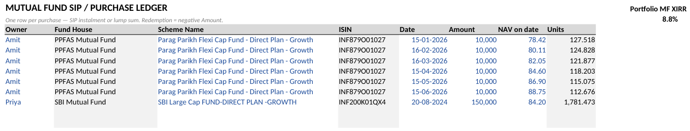

**MutualFunds is the summary** — one row per fund; you type only Owner and
Scheme. Units, invested amount, current value and the fund's XIRR all flow
in from the ledger and the daily AMFI NAV.

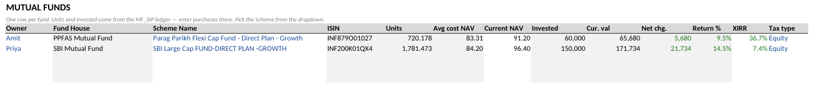

**Worked example — Amit's SIP:** six monthly instalments of ₹10,000 into
Parag Parikh Flexi Cap (15-01-2026 to 15-06-2026). The ledger's units add
up to 720.178; at the current NAV of ₹91.20 that's **₹65,680** against
₹60,000 invested — +9.5%, and an XIRR of 36.7% (six months annualised —
early SIP returns look dramatic; give it time).

The **Tax type** column (Equity/Debt) matters only if you use the capital
gains report — see [section 13](#13-selling--the-taxmans-view). Blank
counts as Equity, and most share funds (including ELSS and index funds)
are Equity.

### Ten years of SIPs without typing — the statement import

Since v1.7 you don't have to type the ledger at all. Every fund investor
in India can request one free, official PDF that lists every purchase,
SIP and sale across **all** their fund houses — the consolidated account
statement (CAS). The updater reads it in for you:

1. **Request the statement** at
   [camsonline.com](https://www.camsonline.com) → *Statements* →
   *CAS – CAMS + KFintech* (KFintech's own site works too). Pick
   **Detailed** — not Summary — and **Since inception**, type your email,
   and choose a password you'll remember. The PDF arrives by email in a
   few minutes.
2. **Save the PDF into the same folder** as your
   `Family_Portfolio_Tracker.xlsx`.
3. **Double-click `Update Portfolio`.** It notices the file, asks for the
   statement's password (the one you chose — it is never stored), and
   shows you what it read: every fund with its transaction count, amount
   and units, each line **checked against the statement's own closing
   balance**. You confirm once; it fills MF_SIP with the exact dates,
   amounts, NAVs and units, and creates any missing MutualFunds summary
   rows.

Here is the whole conversation, exactly as it looks (just press Enter at
each question to accept):

```text
📥 Found CAS_2026.pdf next to your workbook — looks like your fund statement (CAS).
   Read it in? Press Enter for yes, or type n to skip:
  🔑 Password for CAS_2026.pdf (the one you chose when requesting it):

  What CAS_2026.pdf holds:
    ✓ XYZ123 - Parag Parikh Flexi Cap Fund - Direct Plan - Growth —
      3 transaction(s), ₹30,000 in, 588.386 units ·
      matches the statement's closing balance ✓

  👤 Who owns 12345678/90 (Amit Kumar)? 1. Amit, 2. Priya, 3. Rahul [Enter = Amit]:

  Write these into your workbook? If a fund here is already typed on your
  sheets, the statement's exact history replaces those rows (your file is
  backed up first).
  Press Enter to continue, type a to only ADD new entries, or n to cancel:
```

Some honest fine print:

- **Run it again anytime — nothing is added twice.** A newer statement
  just adds the new months. Already-read files are remembered (delete
  their row on the hidden Import_Map sheet to be asked again).
- If a fund is **already typed** on your sheets, the statement's exact
  history replaces those typed rows — after you confirm, and your file
  is backed up first. Choose "only add" at the prompt if you prefer.
- A fund the app **can't read reliably is left out entirely and says
  why** — a number that doesn't prove itself against the statement's own
  arithmetic is never written. Refusing is how the figures stay
  trustworthy.
- Sent the **Summary** variant by mistake? The updater tells you and
  explains how to request the Detailed one.
- Funds held **inside a demat account** may not appear on a CAS — those
  come via your broker's file instead (next section).
- **A very long history still fits.** The ledger saves 3,000 lines; if
  your statement holds more, the updater asks whether it may roll the
  oldest years into one opening line per fund. Totals and each fund's
  closing balance still match the statement — those years just lose
  their per-SIP detail (and the return figure treats them
  approximately). Say no and it simply waits instead.

**Shares from your broker, the same way.** Save your broker's
**tradebook** (trade history) or **holdings** export — **CSV or Excel
(.xlsx)** — in the same folder. Any broker's file works if its columns
are named — symbol or ISIN, date, buy/sell, quantity, price for a
tradebook (separate Buy/Sell quantity columns work too); symbol/ISIN,
quantity, average price for holdings. A banner or summary block above
the table is fine, and a holding the broker carries at **cost 0** (old
paper shares converted to demat) comes in with a blank cost — one
question ("bought before Feb 2018?") dates it so the official 2018
value fills in. Buys become lots with their real dates and prices,
sales are netted off oldest-first, and a holdings file cross-checks the
result against what your broker says you own. One switch to know: if
the file sells shares you had **typed by hand**, turn **Capital gains
report** to Yes on Settings first — the sale is then recorded properly
on Equity_Sells; with it off, that stock is left out with a note saying
exactly this. A stock whose history
can't be read safely — for example a split falls inside the traded
window — is left out with a plain reason, and you add that one by hand.
Sold shares the file never shows you buying (old paper or transferred
holdings)? The import asks: *bought before Feb 2018?* — answer yes and
the official 2018 value stands in as their cost, the same grandfathering
rule as everywhere else.
**Splits and bonuses are never double-counted** (v1.7.1). A holdings
file already shows the share count *after* every split and bonus — so
the app anchors those rows to the import date, and only actions that
happen **later** will adjust them. Your typed rows keep working exactly
as before (their quantity is as-bought, and *Qty today* shows the demat
view).

**Mutual funds inside a broker file come in too** (v1.7.1). Funds held
in a demat account (broker platforms) often don't appear on a CAS —
if your broker's holdings file lists them (with their ISINs), each fund
lands as **one opening line**: today's units at your average cost.
Values are right immediately; the yearly return figure only becomes
exact once real dates arrive — import a CAS that covers the fund, or
type the history, whenever you want that. Bonds and debentures in a
broker file are pointed at the Bonds sheet instead (typed by hand), so
nothing lands as the wrong kind of thing.

Who owns which folio or account is asked once and remembered on the
Import_Map sheet (visible via the *Reference lists* switch) — the left
table holds those answers (fix a wrong Owner right there), the right
table lists the files already read so nothing is offered twice:

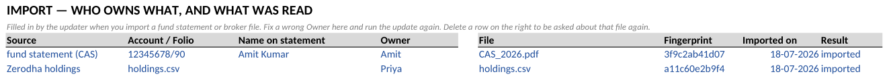

---

## 7. Fixed deposits, PPF and EPF

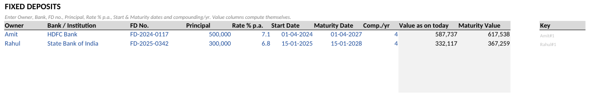

**Fixed deposits:** bank (dropdown), principal, rate, dates, compounding.
The tab shows today's accrued value and the maturity value, and flags
matured FDs. The sample family holds ₹9,19,854 across two FDs.

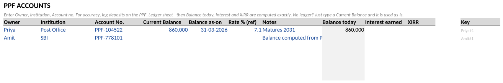

**PPF:** type the balance from your passbook and its date, and the file
grows it at the official rate (the quarterly government rates ship with the
app). Want paisa-exact interest? List your deposits on **PPF_Ledger** —
optional — and interest follows the real rule: monthly minimum balance,
credited each 31 March.

**EPF** (switch it on in Settings): copy one balance and its date from
your EPFO passbook — done. It grows at the declared EPF rate.

---

## 8. Bonds

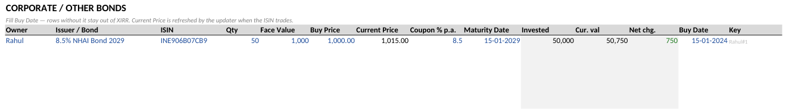

Quantity, buy price, coupon %, maturity — the tab shows today's value
(exchange-priced when the bond trades), the maturity amount, and a
coupon-aware XIRR: every coupon you've already received enters your return
on its actual date.

---

## 9. Gold & silver

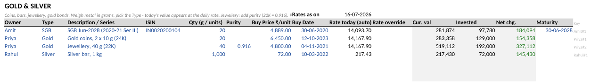

Switch it on in Settings. Three kinds of rows:

- **SGB** (Sovereign Gold Bond — a government bond that prices like a
  share): fill the ISIN from your statement; it prices from the exchange.
- **Jewellery**: grams + purity (22K = 0.916) × the daily bullion rate
  (IBJA — the official jewellers' association rate, fetched every update).
- **Coins/bars**: grams at the same daily rate; purity blank means pure.

Prefer your jeweller's rate? Type it in *Rate override* — it wins.

---

## 10. NPS

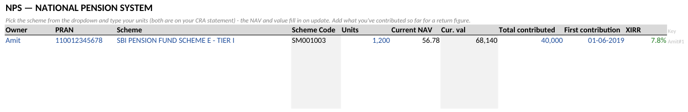

Pick your scheme from the dropdown (every NPS scheme with a daily NAV is
in the list), type your units from the statement — the tab values them at
the daily NPS Trust NAV. Your PRAN stays where it belongs: on your
statement, not in this file.

---

## 11. House, cash, insurance — Manual Assets

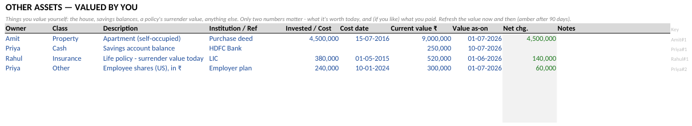

Anything without a market feed: pick the Class (Property / Cash /
Insurance / Other), type what it's worth today, and it joins the family
total. The *Last updated* column turns amber after 90 days — a gentle
nudge to refresh a number only you can know.

---

## 12. Dividends — income you can see

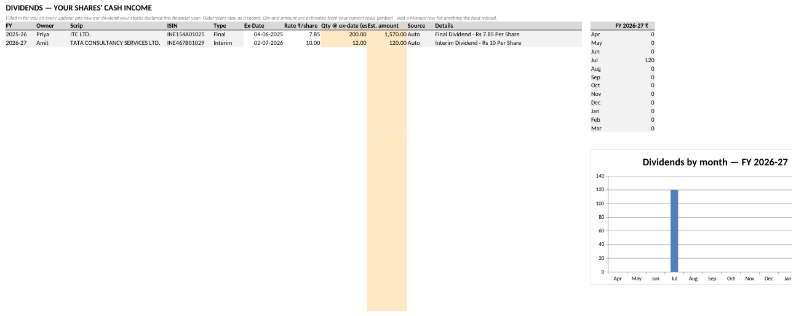

Filled in for you on every update: one row per dividend your stocks
declared this financial year, with an estimated amount (rate × the shares
you held on the ex-date — ex-date = the date that decides who gets the
dividend). Older years stay as a frozen record. The month-by-month chart
shows the cash arriving.

**Worked example:** Priya's 200 ITC shares × ₹7.85 final dividend =
**₹1,570** (FY 2025-26); Amit's 12 TCS shares × ₹10 interim = **₹120**
(FY 2026-27, the ₹120 you saw on the Dashboard).

Two things worth knowing:

- **The feed missed one?** Add a row yourself and set *Source* to
  `Manual`. Manual rows persist and override the automatic one for the
  same dividend. Give every Manual row an **Owner** — a row without one
  counts in the family total but in nobody's per-person figure (the
  updater warns if you forget).
- Since v1.6, **dividends count in your return figure (XIRR)** — real
  cash, really counted, from the day it was yours.

---

## 13. Selling & the taxman's view

*New in v1.6, and off by default — flip **Capital gains report** to Yes on
the Settings tab when you want it.*

Three steps, in this order:

1. **Record the sale on the Equity_Sells tab** — one row per sale, straight
   from your contract note: quantity, buy date, buy price, sell date, sell
   price.
2. **Reduce the Quantity on the Equity tab** — that tab is always *what
   you own now*; Equity_Sells is the record of what you sold.
3. **Switch "Capital gains report" to Yes** on Settings and run the
   update.

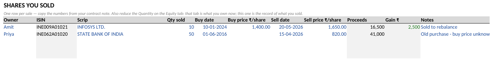

*(Sold fund units? No extra typing — the minus row you added on MF_SIP in
[section 6](#6-mutual-funds--a-summary-tab-and-a-ledger-tab) is enough.)*

The **Capital Gains** tab then reads top-down like a story:

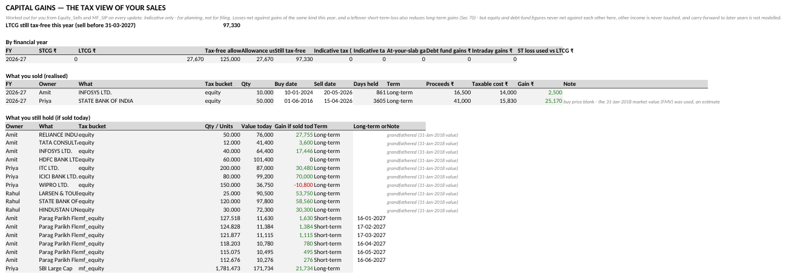

- **The headline first:** *"LTCG still tax-free this year (sell before
  31-03-2027): ₹97,330"* — how much long-term gain the sample family can
  still realise this year without tax.
- **By financial year:** STCG and LTCG (STCG / LTCG = short- / long-term
  capital gains — profit on things you sold; long-term, held over a year,
  is taxed less and gets a tax-free slice each year), the ₹1.25L tax-free
  allowance, how much of it you've used, and an **indicative tax** figure
  at the rates in force on each sale's date — after your same-year losses
  are set off. A last column, "Losses used vs LTCG ₹", shows the amount
  when losses reduced that year's long-term gains — leftover short-term
  losses (debt-fund ones count too) and debt-fund long-term losses — it
  stays blank in a normal year.
- **What you sold (realised):** every sale with its holding period, term,
  taxable cost and gain. Every caveat is written in that row's Note —
  nothing is hidden in a manual.
- **What you still hold (if sold today):** the sell-planning helper — the
  gain the taxman would see per holding, and the exact date each one
  turns long-term.

**Worked example — the grandfathering rule.** Priya sold 50 SBI shares on
15-04-2026 at ₹820, bought back on 01-06-2016 at a price she no longer
knows — so the buy price is left **blank**. The report applies
grandfathering (for shares bought before February 2018, tax counts the
official 31-01-2018 value as your cost — usually kinder to you): taxable
cost **₹15,830**, gain **₹25,170**, term Long-term (3,605 days), and the
Note says exactly what happened: *"buy price blank - the 31-Jan-2018
market value (FMV) was used, an estimate"*. Since the family's total LTCG
of ₹27,670 sits under the ₹1,25,000 allowance, the indicative tax is
**zero**.

### When the government changes the rules

The rates and the tax-free allowance are **not** locked inside the app —
they live on the **Tax_Rules** tab, right in your workbook (it appears with
the other two when the switch is on):

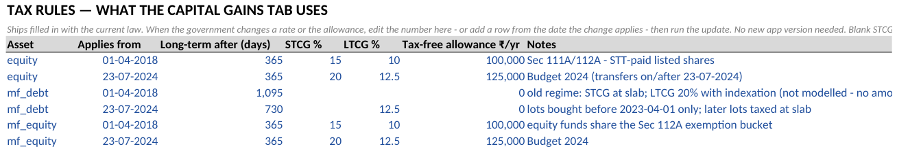

It ships filled in with the current law — including the mid-2024 change,
which is why there are two rows per asset: for every sale, the newest row
on or before its sell date wins. So when a Budget changes something, you
don't wait for a new app version:

- **A rate or the allowance changed?** Add a row with the same Asset, the
  date the change applies from, and the new numbers — or simply edit the
  existing row if the change replaces it outright. Run the update; done.
- **Blank STCG %** means "taxed at your slab" (no amount is computed).
- A row the app can't understand (unknown Asset, missing date) is never
  guessed at — it stays on the tab and every update warns until you fix
  it. Rows the app ships come back if deleted, so edit them instead.

New releases still refresh the shipped defaults for everyone — your own
edits always win for the rows you touched.

Honesty rules the report lives by (each is also written on the sheet):

- **Indicative only — for planning, not for filing.** Carrying a loss
  forward to a later year, and set-off against other kinds of income, are
  not modelled.
- **Sold at a loss? It counts — across your investments.** Losses first
  reduce gains of the same kind; then the law's cross-netting applies
  (Sec 70): a debt-fund loss reduces your taxed share gains too, and a
  leftover short-term loss reduces long-term gains, all *before* the
  tax-free allowance. Losses used against **long-term** gains show in
  their own "Losses used vs LTCG ₹" column — blank in a normal year;
  losses used against short-term gains simply lower the indicative tax
  (the updater's summary line spells out the amount). One honest
  limit stays: losses bigger than your gains are not added to the "still
  tax-free" figure — it never overpromises (they'd carry forward in a
  real filing, which this sheet doesn't model).
- A sale with its old buy price left blank counts in the **tax view
  only** — your return figure (XIRR) needs both sides of the trade.
- Same-day (intraday) trades are **speculative income** — profit taxed at
  your slab as business income, not as capital gains. They get their own
  "Intraday gains ₹" column and their own rows (bucket *speculative*,
  term *Intraday*), so nothing is hidden — but they never mix into
  STCG/LTCG, no tax amount is computed on them, and they stay out of
  your return figure (XIRR).
- When something can't be computed correctly, it is skipped **with a
  warning** — never guessed.

---

## 14. Your return figure (XIRR), honestly

XIRR = your return a year, computed from every dated cashflow — what went
in, what came out, and when. It's the number a fund would quote you, and
the file computes it at every level: portfolio, per class, per fund, per
stock.

What counts, per class: equity buys (and, since v1.6, **dividends and
recorded sales** — so the return you see is the return you actually got);
every mutual-fund instalment and redemption from the ledger; FD principal
against today's accrued value; PPF/EPF balances growing at their rates;
bond coupons on their actual dates.

XIRR cells are **plain values written by the updater** — after you change
a holding, run the update to refresh them.

---

## 15. The Settings tab — show only what you own

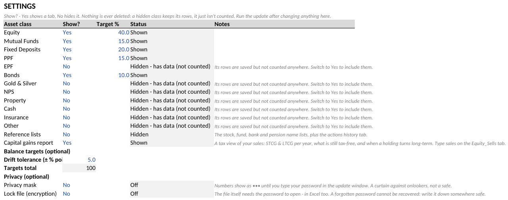

- **One Show? switch per asset class.** *No* hides the tab and leaves it
  out of every total — but its rows are saved, and one amber line on the
  Dashboard reminds you hidden money exists. *Yes* brings everything back.
  Nothing is ever deleted.
- **Reference lists** — the stock/fund/bank/pension name lists behind the
  dropdowns, plus the corporate-actions audit tab. Tucked away by default.
- **Capital gains report** — the Equity_Sells + Capital Gains pair
  ([section 13](#13-selling--the-taxmans-view)).
- **Balance targets** — your target % per class for the Dashboard's
  drift hints, and the tolerance.
- **Privacy** — the two switches below
  ([section 17](#17-privacy--the-mask-and-the-lock)).

The updater also offers the class switches as a numbered menu — no
spreadsheet editing needed. Changes take effect on the next run.

---

## 16. The updater — what a run actually does

Double-click `Update Portfolio` (workbook closed). In order:

1. **Backup** — a dated copy of your file goes to `backups/` (last 10 kept).
2. **Fetch** — BSE + NSE closing prices (merged, so both exchanges'
   listings price), AMFI fund NAVs, corporate actions and dividend
   announcements, NPS NAVs, the IBJA bullion rate. Public data only.
3. **Compute** — corporate-action adjustments, values, XIRR, the capital
   gains report, the FY-end estimate, a dated net-worth snapshot for the
   trend charts.
4. **Regenerate** — the whole workbook is rebuilt with your inputs
   preserved, then swapped into place atomically (a crash can never leave
   you a half-written file).
5. **Summary** — one screen: prices matched, NAVs matched, dividends
   found, your net worth, your XIRR, and any warnings in plain words.

It will also offer to add a family member or show/hide asset classes, and
a once-per-run version check tells you when a newer release exists
(`--no-update-check` turns that off). Since v1.7, a fund statement (CAS
PDF) or broker CSV saved next to the workbook is noticed and offered for
import right here — see [section 6](#6-mutual-funds--a-summary-tab-and-a-ledger-tab);
the command-line equivalent is `--import FILE`.

**Once a week is plenty.** Daily works too — it's your call.

---

## 17. Privacy — the mask and the lock

Nothing about your money ever leaves your machine — that's true with both
switches off. The two optional layers (Settings tab, sharing one password)
protect the *file itself*:

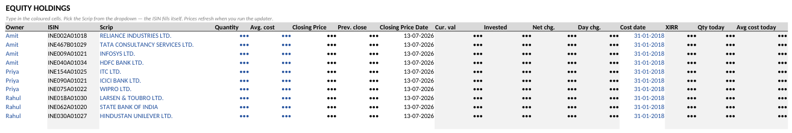

- **Privacy mask** — every number shows as `•••` (names and dates stay).
  A curtain against people glancing at your screen — honest about being a
  curtain. To see numbers: run the update, answer *"see them this time?"*,
  type your password. The next update masks them again by itself (sooner:
  run with `--lock`). Forgot the password? Type `RESET` when asked — the
  mask comes off, nothing is lost.
- **Lock file** — real encryption (Excel's own password-to-open, AES-256).
  Without the password the file is unreadable anywhere — a lost laptop or
  a synced folder reveals nothing. Real also means: **no recovery if you
  forget the password.** Write it down somewhere safe.

Turn either on and run the update — it walks you through choosing the
password. Backups made before locking stay readable; delete the `backups/`
folder if that matters to you.

---

## 18. When something looks wrong

| You see | What it means | What to do |
|---|---|---|
| *"the workbook is open — close it first"* | Excel still has the file | Close the file, run again |
| A scrip/fund missing from the dropdown | Delisted, merged, or very new | Type the name anyway, accept the warning, fill the ISIN yourself |
| A price shaded amber | Stale — the stock didn't trade or is delisted | Nothing, or type a price override |
| *"Dividends sheet is full — dropped the oldest…"* | The ledger keeps ~500 rows | Copy old years to another file if you want the full record |
| *"Equity_Sells holds N rows but the sheet fits 200"* | More sales than the tab stores | Move old years' sale rows to another file, delete them here |
| A dividend row with no Owner (warning) | It counts in the family total but nobody's split | Fill the Owner column on the Dividends tab |
| *"more units redeemed than bought"* | An MF redemption exceeds the ledger's purchases | Check the ledger — a purchase row is probably missing |
| *"Tax_Rules: the row … ignored for now"* | A rules row has an unknown Asset or no date | Fix the row on the Tax_Rules tab (Asset must be equity / mf_equity / mf_debt) |
| Return figures look stale after an edit | XIRR is written at update time | Run the update |
| Charts or dropdowns broke | The file was saved by a tool that drops them | Restore from `backups/`, never "repair" — and never let another program re-save the workbook |
| Moving to a new computer | Everything lives in the one xlsx | Copy the xlsx + the app folder; done |

Still stuck? Open an issue:
[github.com/jay-parikh/NetWorth/issues](https://github.com/jay-parikh/NetWorth/issues)

---

## 19. Words you'll see

| Word | In plain terms |
|---|---|
| **XIRR** | Your return a year, from every rupee in and out on its actual date — it counts *when* you invested, not just how much |
| **NAV** | The price of one unit of a fund |
| **ISIN** | The code on your statement that identifies a stock or fund — it fills in from the dropdown, you rarely type it |
| **Ex-date** | The date that decides who gets a dividend — own the share before it and it's yours |
| **STCG / LTCG** | Short- / long-term capital gains — profit on things you sold. Long-term (shares held over a year) is taxed less, with a tax-free slice each year |
| **Grandfathering** | For shares bought before February 2018, tax counts the official 31-01-2018 value as your cost — usually kinder to you |
| **Speculative income** | Profit from buying and selling the same day (intraday) — taxed at your slab as business income, not as capital gains |
| **FMV** | Fair market value — for grandfathering, the highest traded price on 31-01-2018 |
| **SGB** | Sovereign Gold Bond — a government gold bond that prices like a share |
| **FY** | Financial year, April to March |
| **PRAN / UAN** | Your NPS number / your PF number — both on your statements |

---

*Guide for NetWorth v1.7.0, written 2026-07-18. Screenshots are renders of
the shipped sample workbook. Project home:
[github.com/jay-parikh/NetWorth](https://github.com/jay-parikh/NetWorth).*
